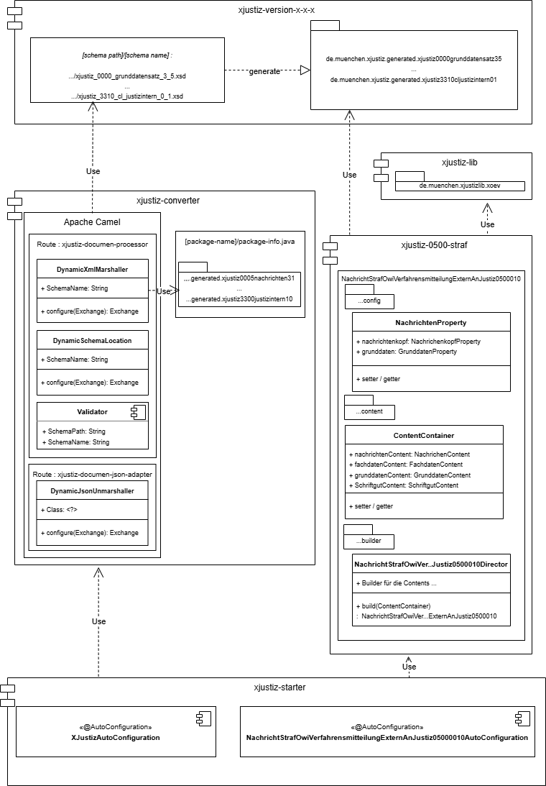

# Dokumentation 
 
## Einleitung

Der [XJustiz](https://xjustiz.justiz.de/index.php) Standard ist eine umfangreicher und komplexer Schnittstellen Standard der aus vielen Fachmodulen mit
XSDs und Dokumenten besteht.

```
Diese Spezifikation dokumentiert den XÖV-Standard XJustiz für den elektronischen Rechtsverkehr.
XJustiz beschreibt ein standardisiertes Datenaustauschformat für den Datenaustausch im elektronischen
Rechtsverkehr. Der Standard wird von der Bund-Länder-Kommission für Informationstechnik in
der Justiz (BLK) herausgegeben und ist frei verfügbar.

Quelle : Spezifikation_XJustiz_351_06_03_2025.pdf, S.1
```

Das xJustiz Projekt ist aus der Notwendigkeit entstanden, im Rahmen eines Fachverfahrens ein xJustiz Standard konformes 
XML Dokument für den Austausch mit der Justiz zu erstellen.

Ziel des Projekts ist es statt xJustiz Dokumente in einem Projektkontext singulär umzusetzen, die Implementierung der Dokumente in einem gemeinsamen Projekt zusammen zu fassen, um möglichst wiederverwendbare Module zu bekommen und damit die Bereitstellung von Dokumenten im xJustiz Standard für andere zu vereinfachen. Zu diesem Zweck stellt das Projekt eine um neue Dokumente erweiterbare Architektur in Form eines _Maven Multimodul Projekts_ zur Verfügung. 

Dabei stehen drei Themen im Zentrum:

* Die Bereitstellung von generierten Klassen aus dem xJustiz Standard.
* Das Marshalling der XML Repräsentation aus Klasseninstanzen. 
* Die Implementierung von Builder/Factories zur Erstellung von xJustiz Dokumenten Klasseninstanzen mit den generierten Klassen.

_Wie kann das xJustiz Projekt mit deinen Artefakten genutzt werden ?_</br>
Will man ein eigenes Dokument erstellen, können ohne weiteren Aufwand die jeweiligen Klassen aus dem _xjustiz-version-x-x-x_ Projekt verwendet werden.</br>
Ebenso kann mit dem _xjustiz-converter_ ohne weiteren Aufwand das XML Marshalling durchgeführt werden - muss es aber nicht.</br> 
Zuletzt kann aus den Anforderungen der eigenen Dokumentenerstelllung noch eine Builder/Factory Implementierung abgeleitet werden, 
die die Erstellung der Dokumenten Klasseninstanzen unterstützt. Dies ist mit Eigeninitiative verbunden, die aber auch ohne Builder/Factory anfällt, 
wenn die eforderlichen Klasseninstanzen mit den fachlichen Inhalten aus der eigenen Domain angereichert werden.  

### Inhalte des [XJustiz](https://xjustiz.justiz.de/index.php) Standard
Zur Veranschaulichung zum Umfang des xJustiz Standards ein paar statistische Zahlen.
In seiner Version 3.5.1 besteht der xJustiz Standard aus 68 einzelnen XSDs. 
Aus 25 XSDs lassen sich Klassen erzeugen die im Klassennamen die mit dem Bezeichner  _Nachricht\*_ beginnen, die also ein xJustiz Dokument repräsentieren.
Alle XSDs ohne eigenes Dokument werden zur Dokumentenerstellung in die Dokumenten XSDs importiert (XSD Modularisierung).

Die nachfolgende Tabelle erhebt keinen Anspruch auf Vollständigkeit und verdeutlicht _zum einen_ den _Umfang der Dokumente des xJustiz Standards_.
Die Dokumente können weitere optionale Submodule mit wiederum optionalen Attributen enthalten. 

Die Liste der Version 3.5.1 ist aber spätestens mit der [xJustiz Version 3.6.2](https://xjustiz.justiz.de/XJustiz-Versionen/index.php) nicht mehr aktuell und
zeigt _zum anderen_ die _Beziehung der Dokumente zu ihren XSDs_, die wiederum für die richtige Konfiguration des XML Marshalling wichtig ist - 
_das XML eines Dokuments kann nur mit der ihr zugeordneten XSD korrekt validiert werden_.

Die aktuellesten XJustiz Versionen können bei [XJustiz](https://xjustiz.justiz.de/index.php) bezogen werden.

| XSD                                                    | Dokumente                                                                                                                                                                                                                                                                                                                                                                                                                                                                                                                                                                                                                                                                                                                                                                                                                                                                                                                                                                                                                                                                                                                                                                                                                                                                                                                                                                                                                                                                                                                                                                                                                   |
|--------------------------------------------------------|-----------------------------------------------------------------------------------------------------------------------------------------------------------------------------------------------------------------------------------------------------------------------------------------------------------------------------------------------------------------------------------------------------------------------------------------------------------------------------------------------------------------------------------------------------------------------------------------------------------------------------------------------------------------------------------------------------------------------------------------------------------------------------------------------------------------------------------------------------------------------------------------------------------------------------------------------------------------------------------------------------------------------------------------------------------------------------------------------------------------------------------------------------------------------------------------------------------------------------------------------------------------------------------------------------------------------------------------------------------------------------------------------------------------------------------------------------------------------------------------------------------------------------------------------------------------------------------------------------------------------------|
| xjustiz_0005_nachrichten_3_1.xsd                       | NachrichtGdsBasisnachricht0005006.class<br/>NachrichtGdsFehler0005007.class<br/>NachrichtGdsUebermittlungSchriftgutobjekte0005005.class                                                                                                                                                                                                                                                                                                                                                                                                                                                                                                                                                                                                                                                                                                                                                                                                                                                                                                                                                                                                                                                                                                                                                                                                                                                                                                                                                                                                                                                                                     |
| xjustiz_0200_familie_3_1.xsd                           | NachrichtFamAllgemein0200001.class                                                                                                                                                                                                                                                                                                                                                                                                                                                                                                                                                                                                                                                                                                                                                                                                                                                                                                                                                                                                                                                                                                                                                                                                                                                                                                                                                                                                                                                                                                                                                                                          | 
| xjustiz_0250_versorgungsauskunft_3_3.xsd               | NachrichtVagAuskunft0250001.class<br/>NachrichtVagAuskunftsersuchen0250002.class<br/>NachrichtVagEmpfangsbestaetigung0250003.class<br/>NachrichtVagFehlerGerichtZuVersorgungstraeger0250004.class<br/>NachrichtVagFehlerVersorgungstraegerZuGericht0250005.class<br/>NachrichtVagGerichtlicheEntscheidung0250006.class<br/>NachrichtVagKurzmitteilungGerichtZuVersorgungstraeger0250007.class<br/>NachrichtVagKurzmitteilungVersorgungstraegerZuGericht0250008.class<br/>NachrichtVagRechtskraftmitteilung0250009.class                                                                                                                                                                                                                                                                                                                                                                                                                                                                                                                                                                                                                                                                                                                                                                                                                                                                                                                                                                                                                                                                                                     |
| xjustiz_0300_insolvenz_3_4.xsd                         | NachrichtInsoInsolvenztabelleUebergabe0300005.class<br/>NachrichtInsoInsolvenztabelleUebergabeAenderung0300006.class<br/>NachrichtInsoIriDatensatzAnfrage0300021.class<br/>NachrichtInsoIriDatensatzAntwort0300022.class<br/>NachrichtInsoIriEinfacheSucheAntwort0300020.class<br/>NachrichtInsoIriFehlermeldung0300023.class<br/>NachrichtInsoIriInitialisierungAnfrage0300017.class<br/>NachrichtInsoIriInitialisierungAntwort0300018.class<br/>NachrichtInsoUebergabeWeitereBeteiligte0300001.class<br/>NachrichtInsoVerfahrenseroeffnung0300009.class<br/>NachrichtInsoVeroeffentlichung0300010$Fachdaten.class<br/>NachrichtInsoVeroeffentlichung0300010.class<br/>NachrichtInsoVeroeffentlichungGerichtssuche0300016.class<br/>NachrichtInsoVeroeffentlichungLoeschung0300011.class<br/>NachrichtInsoVeroeffentlichungsportalVerarbeitungsbestaetigung0300012.class<br/>NachrichtInsoVollzaehligkeitsmitteilung0300014.class                                                                                                                                                                                                                                                                                                                                                                                                                                                                                                                                                                                                                                                                                          |
| xjustiz_0400_register_3_3.xsd                          | NachrichtReg0400003.class                                                                                                                                                                                                                                                                                                                                                                                                                                                                                                                                                                                                                                                                                                                                                                                                                                                                                                                                                                                                                                                                                                                                                                                                                                                                                                                                                                                                                                                                                                                                                                                                   |
| xjustiz_0500_straf_3_5.xsd                             | NachrichtGdsBasisnachricht0005006.class<br/>NachrichtGdsFehler0005007.class<br/>NachrichtStrafAktenzeichenmitteilung0500002.class<br/>NachrichtStrafAsservate0500017.class<br/>NachrichtStrafBfjBenachrichtigung0500650.class<br/>NachrichtStrafBfjBzrAuskunftserteilungAnfrage0500100.class<br/>NachrichtStrafBfjBzrAuskunftserteilungAuskunft0500102.class<br/>NachrichtStrafBfjBzrAuskunftserteilungAuslandsnachricht0500103.class<br/>NachrichtStrafBfjBzrAuskunftserteilungFuehrungszeugnisAuskunft0500105.class<br/>NachrichtStrafBfjBzrHinweis0500301.class<br/>NachrichtStrafBfjBzrMitteilung0500200.class<br/>NachrichtStrafBfjGzrAuskunftserteilungAnfrage0500400.class<br/>NachrichtStrafBfjGzrAuskunftserteilungAuskunft0500402.class<br/>NachrichtStrafBfjGzrMitteilung0500500.class<br/>NachrichtStrafEmpfangsbestaetigung0500018.class<br/>NachrichtStrafErmittlungsErkenntnisverfahren0500001.class<br/>NachrichtStrafFahndung0500016.class<br/>NachrichtStrafLoeschmitteilung0500020.class<br/>NachrichtStrafOwiEinleitungErzwingungshaft0500021.class<br/>NachrichtStrafOwiVerfahrensmitteilungExternAnJustiz0500010.class<br/>NachrichtStrafOwiVerfahrensmitteilungJustizAnExtern0500011.class<br/>NachrichtStrafRechtsmittel0500012.class<br/>NachrichtStrafStrafverfahren0500013.class<br/>NachrichtStrafStrafvollstreckungsverfahren0500008.class<br/>NachrichtStrafVerfahrensausgangsmitteilungJustizZuExtern0500006.class<br/>NachrichtStrafVerfahrensausgangsmitteilungJustizZuJustiz0500007.class<br/>NachrichtStrafVermoegensabschoepfung0500014.class<br/>NachrichtStrafVollstreckungsauftrag0500015.class<br/>NachrichtStrafWebregEintragungsmitteilung0500060.class |
| xjustiz_0600_mahn_3_3.xsd                              | NachrichtGdsBasisnachricht0005006.class<br/>NachrichtGdsFehler0005007.class<br/>NachrichtGdsUebermittlungSchriftgutobjekte0005005.class<br/>NachrichtMahnAktenzeichenmitteilung0600001.class<br/>NachrichtMahnUebergabe0600002.class                                                                                                                                                                                                                                                                                                                                                                                                                                                                                                                                                                                                                                                                                                                                                                                                                                                                                                                                                                                                                                                                                                                                                                                                                                                                                                                                                                                        |
| xjustiz_0900_vollstreckung_3_3.xsd                     | NachrichtVstrEntscheidungSchuldnerwiderspruch0900001.class<br/>NachrichtVstrEntscheidungSchuldnerwiderspruchEintragungsbestaetigung0900002.class<br/>NachrichtVstrFehlermeldung0900008.class<br/>NachrichtVstrSchuldnerverzeichnisAbdrucke0900005.class<br/>NachrichtVstrSchuldnerverzeichnisEintragungKorrektur0900003.class<br/>NachrichtVstrVermoegensverzeichnisUebermittlungKorrektur0900006.class<br/>NachrichtVstrVermoegensverzeichnisUebermittlungsbestaetigungPortal0900007.class                                                                                                                                                                                                                                                                                                                                                                                                                                                                                                                                                                                                                                                                                                                                                                                                                                                                                                                                                                                                                                                                                                                                 |
| xjustiz_1000_vorsorgeregister_3_1.xsd                  | NachrichtGdsBasisnachricht0005006.class<br/>NachrichtGdsFehler0005007.class<br/>NachrichtGdsUebermittlungSchriftgutobjekte0005005.clas<br/>NachrichtZvrErstelleAbfrageProtokollInput1000004.class<br/>NachrichtZvrErstelleAbfrageProtokollOutput1000005.class<br/>NachrichtZvrErstelleAuskunftInput1000010.class<br/>NachrichtZvrErstelleAuskunftOutput1000011.class<br/>NachrichtZvrLadeRegistrierungInput1000006.class<br/>NachrichtZvrLadeRegistrierungOutput1000007.class<br/>NachrichtZvrSucheRegistrierungInput1000008.class<br/>NachrichtZvrSucheRegistrierungOutput1000009.class                                                                                                                                                                                                                                                                                                                                                                                                                                                                                                                                                                                                                                                                                                                                                                                                                                                                                                                                                                                                                                    |
| xjustiz_1300_aussonderung_3_1.xsd                      | NachrichtAussAnbieteverzeichnis1300001.class<br/>NachrichtAussAnbietungEmpfangBestaetigen1300002.class<br/>NachrichtAussAussonderung1300005.class<br/>NachrichtAussAussonderungImportBestaetigen1300006.class<br/>NachrichtAussBewertungEmpfangBestaetigen1300004.class<br/>NachrichtAussBewertungsverzeichnis1300003.class                                                                                                                                                                                                                                                                                                                                                                                                                                                                                                                                                                                                                                                                                                                                                                                                                                                                                                                                                                                                                                                                                                                                                                                                                                                                                                 |
| xjustiz_1400_zwangsversteigerung_3_1.xsd               | NachrichtZvgGerichtExtern1400003.class<br/>NachrichtZvgZwangsversteigerungsInfo1400002.class<br/>NachrichtZvgZwangsversteigerungstermin1400001.class<br/>NachrichtZvgZwangsverwalterGericht1400004.class                                                                                                                                                                                                                                                                                                                                                                                                                                                                                                                                                                                                                                                                                                                                                                                                                                                                                                                                                                                                                                                                                                                                                                                                                                                                                                                                                                                                                    
| xjustiz_1500_zpo_fremdauskunft_3_3.xsd                 | NachrichtZpoAuskunftAnschrift1500001.class<br/>NachrichtZpoAuskunftArbeitgeber1500002.class<br/>NachrichtZpoAuskunftFahrzeug1500003.class<br/>NachrichtZpoAuskunftsersuchen1500004.class<br/>NachrichtZpoFehlermeldung1500005.class<br/>NachrichtZpoPrueffallmeldung1500006.class<br/>NachrichtZpoRechnung1500007.class                                                                                                                                                                                                                                                                                                                                                                                                                                                                                                                                                                                                                                                                                                                                                                                                                                                                                                                                                                                                                                                                                                                                                                                                                                                                                                     |
| xjustiz_1600_smallclaims_3_1.xsd                       | NachrichtScFormAKlageformblatt1600001.class<br/>NachrichtScFormBKorrekturformblatt1600002.class<br/>NachrichtScFormC1Antwortformblatt1600003.class<br/>NachrichtScFormC2Antwortformblatt1600005.class<br/>NachrichtScFormDUrteil1600004.class<br/>NachrichtScFreeformletter1600006.class<br/>NachrichtScWithdrawal1600007.class                                                                                                                                                                                                                                                                                                                                                                                                                                                                                                                                                                                                                                                                                                                                                                                                                                                                                                                                                                                                                                                                                                                                                                                                                                                                                             |
| xjustiz_1900_betreuungsstatistik_3_1.xsd               | NachrichtBestatMonatsmeldung1900001.class                                                                                                                                                                                                                                                                                                                                                                                                                                                                                                                                                                                                                                                                                                                                                                                                                                                                                                                                                                                                                                                                                                                                                                                                                                                                                                                                                                                                                                                                                                                                                                                   |
| xjustiz_2000_kasse_3_0.xsd                             | NachrichtKasseEbaoRechnung2000005.class<br/>NachrichtKasseEbaoZahlungserleichterung2000006.class<br/>NachrichtKasseErledigungen2000012.class<br/>NachrichtKasseFehlermeldung2000015.class<br/>NachrichtKasseKassenzeichenuebernahme2000010.class<br/>NachrichtKasseKostennachricht2000002.class<br/>NachrichtKasseMahnungskopie2000013.class<br/>NachrichtKasseNiederschlagungen2000007.class<br/>NachrichtKasseNiederschlagungsaufhebungen2000008.class<br/>NachrichtKassePkhRechnung2000003.class<br/>NachrichtKassePkhZahlungserleichterung2000004.class<br/>NachrichtKasseRatenplankopie2000014.class<br/>NachrichtKasseSollstellung2000001.class<br/>NachrichtKasseSperrfrist2000009.class<br/>NachrichtKasseZahlungsanzeige2000011.class                                                                                                                                                                                                                                                                                                                                                                                                                                                                                                                                                                                                                                                                                                                                                                                                                                                                              |
| xjustiz_2100_ehug_3_1.xsd                              | NachrichtEhugUebergabe2100001.class                                                                                                                                                                                                                                                                                                                                                                                                                                                                                                                                                                                                                                                                                                                                                                                                                                                                                                                                                                                                                                                                                                                                                                                                                                                                                                                                                                                                                                                                                                                                                                                         |
| xjustiz_2200_eeb_3_1.xsd                               | NachrichtEebZuruecklaufend2200007.class                                                                                                                                                                                                                                                                                                                                                                                                                                                                                                                                                                                                                                                                                                                                                                                                                                                                                                                                                                                                                                                                                                                                                                                                                                                                                                                                                                                                                                                                                                                                                                                     |
| xjustiz_2300_zssr_3_2.xsd                              | NachrichtZssrBestaetigung2300001.class<br/>NachrichtZssrEinreichungSchutzschrift2300002.class<br/>NachrichtZssrFehlermeldung2300003.class<br/>NachrichtZssrMitteilungEinschlaegig2300004.class<br/>NachrichtZssrRuecknahmeSchutzschrift2300005.class                                                                                                                                                                                                                                                                                                                                                                                                                                                                                                                                                                                                                                                                                                                                                                                                                                                                                                                                                                                                                                                                                                                                                                                                                                                                                                                                                                        |
| xjustiz_2400_ezoll_3_1.xsd                             | NachrichtEzollAuskunft2400001.class<br/>NachrichtEzollAuskunftsersuchen2400002.class<br/>NachrichtEzollFehlermeldung2400003.class<br/>NachrichtEzollPrueffallmeldung2400004.class                                                                                                                                                                                                                                                                                                                                                                                                                                                                                                                                                                                                                                                                                                                                                                                                                                                                                                                                                                                                                                                                                                                                                                                                                                                                                                                                                                                                                                           |
| xjustiz_2500_gerichtsvollzieher_3_3.xsd                | NachrichtGvzDatenaustausch2500001.class<br/>NachrichtGvzUebernahmebestaetigung2500002.class                                                                                                                                                                                                                                                                                                                                                                                                                                                                                                                                                                                                                                                                                                                                                                                                                                                                                                                                                                                                                                                                                                                                                                                                                                                                                                                                                                                                                                                                                                                                 |
| xjustiz_3000_schiffsregister_3_1.xsd                   | NachrichtSchirSchiffsdaten3000001.class                                                                                                                                                                                                                                                                                                                                                                                                                                                                                                                                                                                                                                                                                                                                                                                                                                                                                                                                                                                                                                                                                                                                                                                                                                                                                                                                                                                                                                                                                                                                                                                     |
| xjustiz_3100_musterfeststellungsklagenregister_1_2.xsd | NachrichtMfkregBeendigung3100003.class<br/>NachrichtMfkregBerichtigungsbeschluss3100010.class<br/>NachrichtMfkregHinweiseZwischenentscheidung3100002.class<br/>NachrichtMfkregKlagebekanntmachungTerminbestimmung3100001.class<br/>NachrichtMfkregRechtskraftVeroeffentlichungZustellung3100004.class<br/>NachrichtMfkregRegisterauszug3100007.class<br/>NachrichtMfkregRevision3100005.class<br/>NachrichtMfkregVergleichsaustritte3100008.class<br/>NachrichtMfkregVerhandlungRegisterauszugsanforderung3100006.class<br/>NachrichtMfkregZurueckweisungVeroeffentlichung3100009.class                                                                                                                                                                                                                                                                                                                                                                                                                                                                                                                                                                                                                                                                                                                                                                                                                                                                                                                                                                                                                                     |
| xjustiz_3200_ztr_3_0.xsd                               | NachrichtZtrSterbefallInput3200001.class                                                                                                                                                                                                                                                                                                                                                                                                                                                                                                                                                                                                                                                                                                                                                                                                                                                                                                                                                                                                                                                                                                                                                                                                                                                                                                                                                                                                                                                                                                                                                                                    |
| xjustiz_3300_justizintern_1_0.xsd                      | NachrichtIntAbgabeInnerhalbDerJustiz3300001.class                                                                                                                                                                                                                                                                                                                                                                                                                                                                                                                                                                                                                                                                                                                                                                                                                                                                                                                                                                                                                                                                                                                                                                                                                                                                                                                                                                                                                                                                                                                                                                           |

### xJustiz Codelisten

Der [xJustiz Standard bedient sich der XÖV-Codelisten](https://xjustiz.justiz.de/XJustiz-Codelisten/index.php), um Werte für seine Attributinhalte zu definieren.
Alle verwendeten Codelisten sind im [XÖV-Standards und Codelisten](https://www.xrepository.de/) veröffentlicht.
Wird ein Dokumentenattribut mit einer XÖV-Codeliste definiert, wird durch die Codeliste der Wertebereich des 
Attributinhalts festgelegt und kann entsprechend validiert werden.

XÖV-Codelisten und ihre Werte sind vor allem bei der Instanzierung der Dokumenteninstanzen mit den richtigen Werten von 
Bedeutung und wenn man die Werte konfigurabel als Eigenschaften verwalten will. 
Sie sind daher z.Bsp. für die Implementierung von Builder/Factory Modulen wichtig. 

## Maven Multi Modul Projektstruktur 

Aus den Anforderungen bei der Umsetzung des Dokuments _NachrichtStrafOwiVerfahrensmitteilungExternAnJustiz0500010_ 
aus der _xjustiz_0500_straf_3_5.xsd_ beginnend mit der Version XJustiz 3.5.1 wurden bislang die folgenden Maven Module angelegt.

* **xjustiz-lib** : Bibliotheks Modul für Aufgaben die in unterschiedlichen Dokumentkontexten wiederkehren wie Datumsformatierung etc.
* **xjustiz-version-x-x-x** : Kompiliert alle Klassen der XSDs des Standards in eigene Packages.
* **xjustiz-converter** : Dient dem Marshalling der Klassen in XML, reichert das XML um die geforderten XML Namespaces an und validiert das Ergebnis gegen die Dokumenten XSD.
* **xjustiz-0500-straf** : Stellt einen Builder für das Dokument _NachrichtStrafOwiVerfahrensmitteilungExternAnJustiz0500010_ zur Verfügung, der eine Klasseninstanz des Dokuments für das Marshalling im _xjustiz-converter_ liefert. Er ist bislang nicht vollständig 
  und setzt nur den von unserer Fachlichkeit geforderten Inhalt um.
* **xjustiz-starter** : Ein _Spring-Boot Starter Modul_ zur einfachen Einbindung in Spring-Boot Projekte wie unserer [LHM-Referenzarchitecktur](https://refarch.oss.muenchen.de/).



### xjustiz-lib
Das Maven Modul _xjustiz-lib_ unterstützt zum aktuellen Zeitpunkt nur die Implementierung von Builder/Factories wie im Modul _xjustiz-0500-straf_.
Nur für die Verwendung der Module _xjustiz-version-x-x-x_ und _xjustiz-converter_ ist es nicht relevant und kann ignoriert werden.

Es beinhaltet Bibliotheksklassen, die für Konvertierungen, String Formatierungen etc.
gebraucht werden, und Klassen zur Bereitstellung von XÖV Codelisten, um die XSD Validierungen erfolgreich durchlaufen zu können.

Letztlich handelt es sich um "Helper" die _gemeinsam_ xjustiz Dokument _übergreifend eingesetzt_ werden können, um Attributinhalte
von Dokumentklasseninstanzen mit z. Beispiel der richtigen Formatierung oder Inhalten zu bedienen.


#### XJustiz XÖV Codelisten
Da nicht alle Werte der XÖV Codelisten tatsächlich gebraucht werden und noch kein automatisches Einbinden der Codelisten
implementiert ist, müssen diese bis auf weiteres manuel konfiguriert werden.
Sie werden in der _application.yml_ spezifiziert und mit dem _Spring-Boot-Configuration-Processor_ eingelesen. 
Die _ConfigurationProperty_ Klassen liegen im Package _de.muenchen.xjustizlib.xoev_.
Pro Codeliste wird ein Eintrag angelegt. Der _Codelist Name_ ist wie die _Attribut Bezeichner_ frei wählbar, aus Gründen
Zuordenbarkeit sind im Beispiel die Bezeichner der XÖV Codelisten übernommen.

Die [XÖV](https://www.xrepository.de/) Codelisten können versioniert und aktualisiert werden. Das wird unter den jeweiligen _codelist-versions:_ abgebildet.

```
xjustiz:
  codelisten:
    [XÖV Name der Codeliste wg. Zuordnung]
      current-version: [Version mit '.' wie in XÖV]
      codelist-versions:
        [Name frei wählbar][Version mit '-']
           [XÖV Attributname wg Zuordnung]          
```

Daher ist es möglich in der Konfiguration zur Dokumentation "alte" Codelisten beizubehalten und neue hinzuzufügen.
Siehe das Beispiel der _gds-ereignis_ mit den Versionen 1-10 und 1-11.
In den Buildern wird die Codelisten Version verwendet, die als _current-version_ eingetragen ist. 
Im Beispiel der _gds-ereignis_ also die Version 1.11. Beim Hinzufügen einer neuen Codelisten Version 
unter _codelist-versions:_ ist darauf zu achten, das mindestens ein Codeliste Name angelegt ist, 
_der mit der Version der **current-version:** endet_ . Also z.Bsp. abc-1-11, Sonst kann keine gültige Codeliste gefunden werden.

```
xjustiz:
 codelisten:
    gds-rollenbezeichnung:
      current-version: 3.5
      kennung: urn:xoev-de:xjustiz:codeliste:gds.rollenbezeichnung
      codelist-versions:
        gds-rollenbezeichnung-3-5:
          betroffener: '040'
          antragsteller: '016'
    gds-gerichte:
      current-version: 3.6
      kennung: urn:xoev-de:xjustiz:codeliste:gds.gerichte
      codelist-versions:
        gds-gericht-3-6:
          amtsgericht-muenchen: D2601
    gds-ereignis:
      current-version: 1.11
      kennung: urn:xoev-de:xjustiz:codeliste:gds.ereignis
      codelist-versions:
        gds-ereignis-1-11:
          neueingang-e-haft: 117
        gds-ereignis-1-10:
          neueingang-e-haft: 117
   ...
 
```
Siehe auch das Beispiel _test/ressources/application.yaml_.

##### Zugriff auf die manuell definiertem XÖV Codelisten mit ihren Werten
Die **Codelisten-Werte** müssen in xJustiz in eigenen _CodeGDS..._ Klassen zusammen mit der **Codelisten-Version** übermittelt werden.

Beispielhaft ist das im _Builder.createCodeGDSClass(...)_ umgesetzt.
Für jede in der _application.yml_ angelegte Codeliste ist in _xoev.codelisten.XoevCodeGDS_ ein enum angelegt und für jedes angelegte **enum** existiert in _xoev.codelisten_ eine weitere **enum Klasse** mit den im Code verwendeten Werten.
Mit den Klassen _XJustizProperty_ und _CodelistenProperty_ lassen sich auf die Werte in den application.yml codelisten zugreifen.

```
FachdatenBuilder extends Builder:
...
   anschrift.setAnschriftstyp((CodeGDSAnschriftstyp) createCodeGDSClass(XoevCodeGDS.CODE_GDS_ANSCHRIFTSTYP, XoevCodeGDSAnschriftstypen.TATORTANSCHRIFT.getDescriptor()));
...

Builder.createCodeGDSClass(...):
...
 switch (codeGDS) {
    case XoevCodeGDS.CODE_GDS_ANSCHRIFTSTYP:
      CodeGDSAnschriftstyp anschriftTyp = new CodeGDSAnschriftstyp();
      anschriftTyp.setCode(xjustizProperty.getCodelisten().get(XoevCodeGDS.CODE_GDS_ANSCHRIFTSTYP.getDescriptor()).currentCodelistValueWithKey(codelistValueKey));
      anschriftTyp.setListVersionID(xjustizProperty.getCodelisten().get(XoevCodeGDS.CODE_GDS_ANSCHRIFTSTYP.getDescriptor()).getCurrentVersion());
      code = anschriftTyp;
      break;
...
return code;
...                
```

### xjustiz-version-x-x-x
Die einzige Aufgabe des Maven Moduls _xjustiz-version-x-x-x_ ist es die unter _src/main/java/resources/xsd/xjustiz-version-x-x-x_ liegenden XSDs mit dem
_jaxb2-maven-plugin_ in Java Klassen zu compilieren.

Jede XSD hat ihr eigenes _execution_ Element, um die Klassen der XSD in einem eigenen _Java-Package_ zu isolieren.
Das führt dazu das gemeinsam genutzte Klassen in jedem Package einzeln vorliegen.

Ohne explizite _execution_ Elemente würde gemeinsam genutzte Klassen auch nur einmal compiliert vorliegen, jedoch würden
alle Dokumentklassen ebenfalls in dem 'gemeinsamen' Package ohne Trennung liegen.

```
<execution>
    <id>xjustiz_0000_grunddatensatz_3_6</id>
    <goals>
        <goal>xjc</goal>
    </goals>
    <configuration>
        <sources>
            <source>${project.basedir}/src/main/resources/xsd/xjustiz-x-x-x-xsd/xjustiz_0000_grunddatensatz_3_6.xsd</source>
        </sources>
        <arguments>
            <argument>-npa</argument>
        </arguments>
        <outputDirectory>${project.basedir}/target/generated-sources/jaxb/xjustiz0000grunddatensatz36</outputDirectory>
        <packageName>de.muenchen.xjustiz.generated.xjustiz0000grunddatensatz36</packageName>
    </configuration>
</execution>

```
#### XSD-Bindings
Wegen zu langer Klassennamen war bei einer XSD eine Anpassung der Namen per _main/resources/bindings.xjb_ erforderlich.

#### Python Scripte
Im Projektverzeichnis _xjustiz/scripts_ liegen verschiedene Python Scripte für die Auswertung von xJustiz XSDs die auf
einen CMD mit Python Interpreter ausgeführt werden können.

| Name                                       | Beschreibung                                                                                                                        |
|--------------------------------------------|-------------------------------------------------------------------------------------------------------------------------------------|
| jaxb2-maven-plugin-execution-generation.py | Erstellt _jaxb2-maven-plugin **excecution** Ausdrücke_ für eine neue xJustiz Version.                                               |
| xsd_tree_flat.py                           | Ist mit der Ausgabe _mvn dependency:tree_ vergleichbar.<br/> XSD Inhalte können in einer einfachen Form als 'tree' angezeigt werden |
| xsd_tree_recursive.py                      | Wie _xsd_tree_flat.py_, es werden jedoch mehr Informationen angezeigt.                                                              |


```
Z.Bsp. :  $ python -X utf8 xsd_tree_recursive.py ../xjustiz-version-x-x-x/src/main/resources/xsd/xjustiz-x-x-x-xsd/xjustiz_0500_straf_3_6.xsd nachricht.straf.owi.verfahrensmitteilung.externAnJustiz.0500010
Schema-Übersicht für: ..\xjustiz-version-x-x-x\src\main\resources\xsd\xjustiz-x-x-x-xsd\xjustiz_0500_straf_3_6.xsd

└── Schema xjustiz_0500_straf_3_6.xsd [ns=tns]
    └── {http://www.xjustiz.de}nachricht.straf.owi.verfahrensmitteilung.externAnJustiz.0500010 [ns=tns , file=xjustiz_0500_straf_3_6.xsd]
        ├── {http://www.xjustiz.de}nachrichtenkopf : {http://www.xjustiz.de}Type.GDS.Nachrichtenkopf [ns=tns , file=xjustiz_0000_grunddatensatz_3_6.xsd]
        │   ├── @xjustizVersion [ns=tns , file=xjustiz_0000_grunddatensatz_3_6.xsd]
        │   ├── {http://www.xjustiz.de}erstellungszeitpunkt : {http://www.w3.org/2001/XMLSchema}dateTime [ns=tns , file=xjustiz_0000_grunddatensatz_3_6.xsd]
        │   ├── {http://www.xjustiz.de}absender [ns=tns , file=xjustiz_0000_grunddatensatz_3_6.xsd]
        │   │   ├── {http://www.xjustiz.de}informationen : {http://www.xjustiz.de}Type.GDS.Kommunikationspartner [ns=tns , file=xjustiz_0000_grunddatensatz_3_6.xsd]
        │   │   │   ├── {http://www.xjustiz.de}auswahl_kommunikationspartner [ns=tns , file=xjustiz_0000_grunddatensatz_3_6.xsd]
        │   │   │   │   ├── {http://www.xjustiz.de}gericht : {http://www.xjustiz.de}Code.GDS.Gerichte.Typ3 [ns=tns , file=xjustiz_0000_grunddatensatz_3_6.xsd]
        │   │   │   │   │   ├── @listURI (0..1) [ns=tns , file=xjustiz_0020_cl_gerichte_3_3.xsd]
        │   │   │   │   │   ├── @listVersionID [ns=tns , file=xjustiz_0020_cl_gerichte_3_3.xsd]
        │   │   │   │   │   └── code : {http://www.w3.org/2001/XMLSchema}token [ns=tns , file=xjustiz_0020_cl_gerichte_3_3.xsd]
        │   │   │   │   ├── {http://www.xjustiz.de}sonstige : {urn:xoev-de:kosit:xoev:datentyp:din-91379_2022-08}datatypeD [ns=tns , file=xjustiz_0000_grunddatensatz_3_6.xsd]
        │   │   │   │   ├── {http://www.xjustiz.de}rvTraeger : {http://www.xjustiz.de}Code.GDS.RVTraeger [ns=tns , file=xjustiz_0000_grunddatensatz_3_6.xsd]
        │   │   │   │   │   ├── @listURI (0..1) [ns=tns , file=xjustiz_0010_cl_allgemein_3_7.xsd]
        │   │   │   │   │   ├── @listVersionID (0..1) [ns=tns , file=xjustiz_0010_cl_allgemein_3_7.xsd]
        │   │   │   │   │   └── code : {http://www.xjustiz.de}gds.rvtraeger [ns=tns , file=xjustiz_0010_cl_allgemein_3_7.xsd]
        │   │   │   │   │       └── [bereits angezeigt]
        │   │   │   │   ├── {http://www.xjustiz.de}polizeibehoerde : {http://www.xjustiz.de}Code.GDS.Polizeibehoerden.Typ3 [ns=tns , file=xjustiz_0000_grunddatensatz_3_6.xsd]
        │   │   │   │   │   ├── @listURI (0..1) [ns=tns , file=xjustiz_0010_cl_allgemein_3_7.xsd]
        │   │   │   │   │   ├── @listVersionID [ns=tns , file=xjustiz_0010_cl_allgemein_3_7.xsd]
        │   │   │   │   │   └── code : {http://www.w3.org/2001/XMLSchema}token [ns=tns , file=xjustiz_0010_cl_allgemein_3_7.xsd]
        │   │   │   │   │       └── [bereits angezeigt]
        │   │   │   │   └── {http://www.xjustiz.de}finanzbehoerde : {http://www.xjustiz.de}Code.GDS.Finanzbehoerden.Typ3 [ns=tns , file=xjustiz_0000_grunddatensatz_3_6.xsd]
        │   │   │   │       ├── @listURI (0..1) [ns=tns , file=xjustiz_0010_cl_allgemein_3_7.xsd]
        │   │   │   │       ├── @listVersionID [ns=tns , file=xjustiz_0010_cl_allgemein_3_7.xsd]
        │   │   │   │       └── code : {http://www.w3.org/2001/XMLSchema}token [ns=tns , file=xjustiz_0010_cl_allgemein_3_7.xsd]
        │   │   │   │           └── [bereits angezeigt]
        │   │   │   ├── {http://www.xjustiz.de}routingInformationAusSafeverzeichnis (0..1) : {urn:xoev-de:kosit:xoev:datentyp:din-91379_2022-08}datatypeC [ns=tns , file=xjustiz_0000_grunddatensatz_3_6.xsd]
        │   │   │   └── {http://www.xjustiz.de}auswahl_verweisGrunddaten (0..1) [ns=tns , file=xjustiz_0000_grunddatensatz_3_6.xsd]
        │   │   │       ├── {http://www.xjustiz.de}ref.instanznummer : {urn:xoev-de:kosit:xoev:datentyp:din-91379_2022-08}datatypeC [ns=tns , file=xjustiz_0000_grunddatensatz_3_6.xsd]
        │   │   │       └── {http://www.xjustiz.de}ref.rollennummer : {http://www.xjustiz.de}Type.GDS.Ref.Rollennummer [ns=tns , file=xjustiz_0000_grunddatensatz_3_6.xsd]
        │   │   │           └── {http://www.xjustiz.de}ref.rollennummer : {urn:xoev-de:kosit:xoev:datentyp:din-91379_2022-08}datatypeC [ns=tns , file=xjustiz_0000_grunddatensatz_3_6.xsd]
        │   │   │               └── [bereits angezeigt]
        │   │   ├── {http://www.xjustiz.de}aktenzeichen (0..1) : {urn:xoev-de:kosit:xoev:datentyp:din-91379_2022-08}datatypeC [ns=tns , file=xjustiz_0000_grunddatensatz_3_6.xsd]
        │   │   └── {http://www.xjustiz.de}eigeneNachrichtenID : {http://www.xjustiz.de}Type.GDS.Xdomea.stringUUIDType [ns=tns , file=xjustiz_0000_grunddatensatz_3_6.xsd]
        │   ├── {http://www.xjustiz.de}empfaenger [ns=tns , file=xjustiz_0000_grunddatensatz_3_6.xsd]
        │   │   ├── {http://www.xjustiz.de}informationen : {http://www.xjustiz.de}Type.GDS.Kommunikationspartner [ns=tns , file=xjustiz_0000_grunddatensatz_3_6.xsd]
        │   │   │   └── [bereits angezeigt]
        │   │   ├── {http://www.xjustiz.de}auswahl_aktenzeichen [ns=tns , file=xjustiz_0000_grunddatensatz_3_6.xsd]
        │   │   │   ├── {http://www.xjustiz.de}aktenzeichen.freitext : {urn:xoev-de:kosit:xoev:datentyp:din-91379_2022-08}datatypeC [ns=tns , file=xjustiz_0000_grunddatensatz_3_6.xsd]
        │   │   │   ├── {http://www.xjustiz.de}aktenzeichen.neu : {http://www.w3.org/2001/XMLSchema}boolean [ns=tns , file=xjustiz_0000_grunddatensatz_3_6.xsd]
        │   │   │   └── {http://www.xjustiz.de}aktenzeichen.unbekannt : {http://www.w3.org/2001/XMLSchema}boolean [ns=tns , file=xjustiz_0000_grunddatensatz_3_6.xsd]
        │   │   └── {http://www.xjustiz.de}fremdeNachrichtenID (0..1) : {http://www.xjustiz.de}Type.GDS.Xdomea.stringUUIDType [ns=tns , file=xjustiz_0000_grunddatensatz_3_6.xsd]
        │   ├── {http://www.xjustiz.de}nachrichtenuebergreifenderProzess (0..1) : {http://www.xjustiz.de}Type.GDS.NachrichtenuebergreifenderProzess [ns=tns , file=xjustiz_0000_grunddatensatz_3_6.xsd]
        │   │   ├── {http://www.xjustiz.de}prozessID : {http://www.xjustiz.de}Type.GDS.Xdomea.stringUUIDType [ns=tns , file=xjustiz_0000_grunddatensatz_3_6.xsd]
        │   │   ├── {http://www.xjustiz.de}nachrichtenNummer (0..1) : {http://www.w3.org/2001/XMLSchema}integer [ns=tns , file=xjustiz_0000_grunddatensatz_3_6.xsd]
        │   │   └── {http://www.xjustiz.de}nachrichtenAnzahl (0..1) : {http://www.w3.org/2001/XMLSchema}integer [ns=tns , file=xjustiz_0000_grunddatensatz_3_6.xsd]
        │   ├── {http://www.xjustiz.de}ereignis (0..*) : {http://www.xjustiz.de}Code.GDS.Ereignis.Typ3 [ns=tns , file=xjustiz_0000_grunddatensatz_3_6.xsd]
        │   │   ├── @listURI (0..1) [ns=tns , file=xjustiz_0010_cl_allgemein_3_7.xsd]
        │   │   ├── @listVersionID [ns=tns , file=xjustiz_0010_cl_allgemein_3_7.xsd]
        │   │   └── code : {http://www.w3.org/2001/XMLSchema}token [ns=tns , file=xjustiz_0010_cl_allgemein_3_7.xsd]
        │   │       └── [bereits angezeigt]
        │   ├── {http://www.xjustiz.de}herstellerinformation : {http://www.xjustiz.de}Type.GDS.Herstellerinformation [ns=tns , file=xjustiz_0000_grunddatensatz_3_6.xsd]
        │   │   ├── {http://www.xjustiz.de}nameDesProdukts : {urn:xoev-de:kosit:xoev:datentyp:din-91379_2022-08}datatypeD [ns=tns , file=xjustiz_0000_grunddatensatz_3_6.xsd]
        │   │   ├── {http://www.xjustiz.de}herstellerDesProdukts : {urn:xoev-de:kosit:xoev:datentyp:din-91379_2022-08}datatypeD [ns=tns , file=xjustiz_0000_grunddatensatz_3_6.xsd]
        │   │   └── {http://www.xjustiz.de}version : {urn:xoev-de:kosit:xoev:datentyp:din-91379_2022-08}datatypeC [ns=tns , file=xjustiz_0000_grunddatensatz_3_6.xsd]
        │   ├── {http://www.xjustiz.de}sendungsprioritaet (0..1) : {http://www.xjustiz.de}Code.GDS.Sendungsprioritaet.Typ3 [ns=tns , file=xjustiz_0000_grunddatensatz_3_6.xsd]
        │   │   ├── @listURI (0..1) [ns=tns , file=xjustiz_0010_cl_allgemein_3_7.xsd]
        │   │   ├── @listVersionID [ns=tns , file=xjustiz_0010_cl_allgemein_3_7.xsd]
        │   │   └── code : {http://www.w3.org/2001/XMLSchema}token [ns=tns , file=xjustiz_0010_cl_allgemein_3_7.xsd]
        │   │       └── [bereits angezeigt]
        │   └── {http://www.xjustiz.de}auswahl_vertraulichkeit (0..1) [ns=tns , file=xjustiz_0000_grunddatensatz_3_6.xsd]
        │       ├── {http://www.xjustiz.de}vertraulichZuBehandelnGrund : {urn:xoev-de:kosit:xoev:datentyp:din-91379_2022-08}datatypeC [ns=tns , file=xjustiz_0000_grunddatensatz_3_6.xsd]
        │       └── {http://www.xjustiz.de}geheimhaltungsgrad : {http://www.xjustiz.de}Code.GDS.Geheimhaltungsgrad.Typ3 [ns=tns , file=xjustiz_0000_grunddatensatz_3_6.xsd]
        │           ├── @listURI (0..1) [ns=tns , file=xjustiz_0010_cl_allgemein_3_7.xsd]
        │           ├── @listVersionID [ns=tns , file=xjustiz_0010_cl_allgemein_3_7.xsd]
        │           └── code : {http://www.w3.org/2001/XMLSchema}token [ns=tns , file=xjustiz_0010_cl_allgemein_3_7.xsd]
        │               └── [bereits angezeigt]
...

```

### xjustiz-converter
Das Maven Modul _xjustiz-converter_ bekommt als _Input_ die um Informationen ergänzten Klasseninstanzen des XML Dokuments und durchläuft drei Arbeitsschritte:

1. _XML Marshalling_
2. Anreichern des _XML Wurzelelements_ um die Namespace Anforderungen des xJustiz Standards.
3. _Validierung_ des erstellten und geänderten XMLs mit seiner XSD Datei.

Werden alle drei Schritte erfolgreich durchlaufen, erfolgt der _Output_ des erstellten und validierten XMLs. Im Fehlerfall 
erfolgt die Rückgabe der Fehlernachricht.

Im Modul _xjustiz-version-x-x-x_ werden alle Dokumentklassen in isolierte Packages ausgegeben. Damit der _xjustiz-converter_ 
seine Aufgaben Marshalling, Anreicherung und Validierung erledigen kann braucht er bei seinem Aufruf daher den 
_Packagenamen_ und den _Namen der XSD Datei_ für das xJustiz Dokument das zur Bearbeitung ansteht.

#### Bearbeitung des XML Wurzelements 
Um den xJustiz Standard zu erfüllen muss das Wurzelelement des XML um **Namespaces** und die **SchemaLocation** ergänzt werden. 
Für eine genauere Beschreibung siehe die [xJustiz Spezifikationsbeschreibung](https://xjustiz.justiz.de/XJustiz-Versionen/index.php). 
Hier ein Beispiel:

```
<tns:nachricht.eeb.zuruecklaufend.2200007 
     xmlns:tns="http://www.xjustiz.de" 
     xmlns:din91379="urn:xoevde:kosit:xoev:datentyp:din-91379_2022-08"
     xmlns:xsi="http://www.w3.org/2001/XMLSchema-instance"
     xsi:schemaLocation="http://www.xjustiz.de
     xjustiz_2200_eeb_3_1.xsd">
...

Quelle:  Spezifikation_XJustiz_351_06_03_2025.pdf, S.3
```
In der Klasse _de.muenchen.xjustiz.config.DynamicXmlMarshaller_ wird Jakarta-Marshaller für das Dokument mit seinen Packageklassen und XSD konfiguriert.
Im Package _de.muenchen.xjustiz.generated.[xsdNameIdentifier]_ liegen für jede XSD die _package-info.java_ Klassen mit den **Namespace** Informationen.

Die **SchemaLocation** wird in der Klasse _de.muenchen.xjustiz.config.DynamicSchemaLocation_ ergänzt.

#### Implementierungsdetails, Aufruf und Konfiguration
Der _xjustiz-converter_ bedient sich einer [Apache Camel](https://camel.apache.org/) _Route_ um die einzelnen Schritte zu durchlaufen.
Die Camel Route behandelt Exceptions nicht (_handled(false)_) und gibt alle Exceptions an den Aufrufer zurück.

Wer Apache Camel nutzt kann die Camel Route des _xjustiz-converter_ z.Bsp. mit dem Camel _direct_ Protokoll ansprechen.
Wer kein Camel Projekt hat kann einfach in einer Spring Komponente den Aufruf der Route realisieren. Siehe die Beispiele unten.

Derzeit stehen zwei Apache Camel Routen zur Verfügung an die entweder ein JSON Repräsentanz des xJustiz Documents oder eine Klasseninstanz direkt übergeben werden kann.
Die JSON-Adapter Route wandelt das JSON zunächst in eine Klasseninstanz um, bevor sie das Ergebnis dann zur eigentlichen Konvertierung weiterreicht.
Mit der Unterstützung von Apache Camel sind viele weitere [Adapter Anbindungen](https://camel.apache.org/components/latest/index.html) denkbar, sofern sie auch als [Camel Consumer](https://camel.apache.org/manual/endpoint.html) implementiert sind. 

Die nachfolgende Konfiguration ist der Testumgebung des _xjustiz-0500-straf_ Moduls entnommen und bedient sich der [Apache Camel Direct](https://camel.apache.org/components/latest/direct-component.html) Komponente. 

#### Konfiguration

```
xjustiz:
  xsd:
    path: xsd/xjustiz-x-x-x-xsd/                               <-- Zum Auffinden der XSD Dateien im verwendenten xjustiz-version-x-x-x Modul fuer die Validierung
    generated-package-base: de.muenchen.xjustiz.generated      <-- Zum Auffinden der [xsdIdentifier]/package-info.java
  interface:
    document:
      processor: direct:xjustiz-document-processor             <-- Klasseninstanz Adapter mit Marshalling, Anreicherung und Validierung.
      json-adapter: direct:xjustiz-document-json-adapter       <-- Json Adapter

```
Das Apache Camel Protokoll _direct_ mit seinem _Bezeichner_ ist Variabel und kann angepasst werden.

Mit dieser Konfiguration kann die XJustiz Document Generierung einfach in eine eigene Anwendung mit Camel Kontext per Spring-Boot Starter eingebunden werden.

##### Einbindung aus Spring Kontext ohne eigenen Apache Camel Kontext
Beispiele für eine Anbindung ohne eigenen Apache Camel Kontext finden sich auch in den _Testfällen_ des _xjustiz-05000-straf_ Moduls.
Dazu muss ein Apache Camel Exchange mit den gewünschten Fachdaten im Exchange Body erstellt und dieser per Camel Producer versendet werden.

```

<dependency>
    <groupId>org.apache.camel.springboot</groupId>             <-- Ggf. als transitive Abhängigkeit (?) aus dem xjustiz-converter Artefakt schon vorhanden. Sonst ergaenzen.
    <artifactId>camel-spring-boot-starter</artifactId>
    <version>[Aktuelle Version]</version> 
</dependency>


@Component
public class CamelCallExample {

  @Produce("direct:xjustiz-document-processor")                 <-- Bei einer xjustiz-converter Konfiguration siehe oben.
  private ProducerTemplate xjustizDocumentProducer;

  @Autowired
  private CamelContext camelContext;

  public String xjustizExampleCall() {
  
        final Exchange request = ExchangeBuilder.anExchange(camelContext)
                .withHeader(DynamicXmlMarshaller.SCHEMA_PATH, "xsd/xjustiz-x-x-x-xsd/")
                .withHeader(DynamicXmlMarshaller.SCHEMA_NAME, "xjustiz_2200_eeb_3_1.xsd")
                .withBody([xJustiz-Document-Klasseninstanz])      <-- Bei Aufruf xjustiz.interface.document.processor
                .build();
  
        var response  = xjustizDocumentProducer.send(request);
        String xml = response.getMessage().getBody(String.class);
        Exception exception = response.getException();
        ...
  }
}
```
Dokumentation [Apache Camel Producer](https://camel.apache.org/manual/producertemplate.html).

### xjustiz-0500-straf
Das _xjustiz-0500-straf_ Modul ist ein Builder Projekt für das Dokument _NachrichtStrafOwiVerfahrensmitteilungExternAnJustiz0500010_.
Mit dem Builder können die generierten Klasseninstanzen aus dem Package _de.muenchen.xjustiz.generated.xjustiz0500straf35_ des 
Moduls _justiz-version-x-x-x_ um Werte aus einer Fachdomain vor ihrem XML Marshalling angereichert werden.
Derzeit werden nur die Attribute behandelt, die für unseren Anwendungsfall erforderliche sind. 
Über eine Eingabe Schnittstelle werden die Fachdaten übermittelt und der Builder liefert eine um die Fachdaten angereicherte Klasseninstanz zurück.

#### Fachdaten
Die Fachdaten lassen sich unterscheiden in 'dynamische' und 'statische' Inhalte.

##### Statische Fachdaten 
Die _statischen_ Fachdaten werden in der Spring-Boot _application.yml_ definiert 
und mit dem _Spring-Boot-Configuration-Processor_ eingelesen. Die _ConfigurationProperty_ Klassen liegen im Package 
_de.muenchen.xjustiz.xjustiz0500straf.nachricht.straf.owi.verfahrensmitteilung.extern.an.justiz0500010.config_.

Um die Inhalte den Dokumentinhalten besser zuordnen zu können (Lesbarkeit) folgen die Eigenschaften Klassen im _...config_ Package 
der Dokumentenstruktur von _NachrichtStrafOwiVerfahrensmitteilungExternAnJustiz0500010_.

#### Dynamische Fachdaten
Die _dynamischen_ Fachdaten werden über die Klassen im Package _de.muenchen.xjustiz.xjustiz0500straf.nachricht.straf.owi.verfahrensmitteilung.extern.an.justiz0500010.content_
definiert. Ihre Klassenstruktur folgt wie die Struktur des statischen Fachdaten zwecks der Lesbarkeit der 
Struktur des Dokuments _NachrichtStrafOwiVerfahrensmitteilungExternAnJustiz0500010_.

Die Klasse _de.muenchen.xjustiz.xjustiz0500straf.nachricht.straf.owi.verfahrensmitteilung.extern.an.justiz0500010.content.ContentContainer_ 
dient als Container zur Übergabe aller Fachdateninhalte.

#### Builder
Die Dokumenteninstanz des Dokuments _NachrichtStrafOwiVerfahrensmitteilungExternAnJustiz0500010_ wird mit statischen und dynamischen Fachdaten mittels des   
_NachrichtStrafOwiVerfahrensmitteilungExternAnJustiz0500010Director_ erstellt.

Der _...Director_ ist eine Spring Komponente, die über die über ihre _build(...)_ Methode ausgeführt wird. 
Als Aufruf-Wrapper für die Builder dient die Klasse _de.muenchen.xjustiz.xjustiz0500straf.nachricht.ExternAnJustiz0500010DocumentStart_.


### xjustiz-starter
Das _xjustiz-starter_ Modul erlaubt die Definition von Spring-Boot Starter Konfigurationen für den xjustiz-converter oder 
Builder/Factory Module, um die xJustiz Dokumenten und XML Generierung in das eigene Spring-Boot zu integrieren.

#### Einbindung des xJustizStarter
Der xJustizStarter kann über eine Apache Camel Route direkt oder in einer Spring-Boot Componente aufgerufen werden.

##### Konfiguration der Spring-Boot-Starter Klasse : _XJustizAutoConfiguration_
Die Spring-Boot Autokonfiguration braucht im Minimum die folgenden Attribute in der application.yml damit sie aktiviert wird.
Damit kann die Apache Camel Route zur Generierung der xJustiz Dokumente gestartet werden. Ohne die Konfiguration der XÖV Codelisten ist aber keine erfolgreiche XSD Validierung möglich.

```
...
xjustiz:
  version: 3.6.2        # Version der xJustiz.
  xsd:                  
    path: xsd/xjustiz-x-x-x-xsd/
    generated-package-base: de.muenchen.xjustiz.generated
  xjustiz0500straf:
    xsd:
      name: xjustiz_0500_straf_3_6.xsd   
  interface:
      document:
        processor: direct:xjustiz-document-processor      #  Einstiegspunkt der Apache Camel Route fuer die Konvertierung. 
...

```

##### Maven Artefakt dem eigenen Projekt hinzufügen

```
<dependency>
   <groupId>...</groupId>
   <artifactId>xjustiz-starter</artifactId>
   <version>[latest Version]</version>
</dependency>
```


## Source Code holen

Sourcen auf den lokalen Rechner holen

    git clone https://github.com/it-at-m/xjustiz.git
